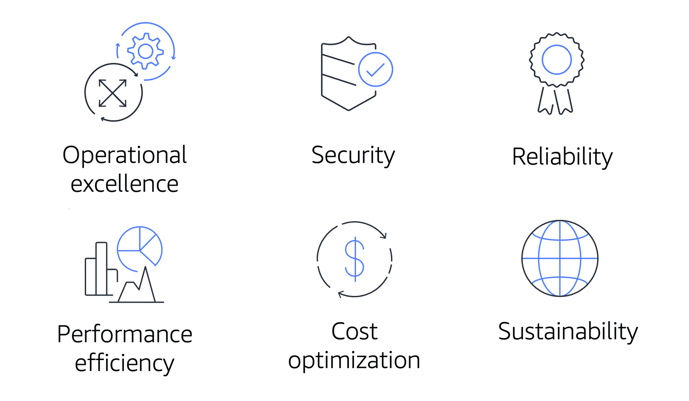

# Cloud Journey
## AWS Well-Architected Framework
- key concepts, design principles, and architectural best practices for designing and running workloads in the cloud. 

### Operational Excellence Pillar
- The operational excellence pillar focuses on running and monitoring systems, and continually improving processes and procedures. 
- automating changes, responding to events, and defining standards to manage daily operations.

### Security Pillar
- The security pillar focuses on protecting information and systems. 
- confidentiality and integrity of data, managing user permissions, and establishing controls to detect security events.

### Reliability Pillar
- The reliability pillar focuses on workloads performing their intended functions and how to recover quickly from failure to meet demands.
- distributed system design, recovery planning, and adapting to changing requirements.

### Performance Efficiency Pillar
- The performance efficiency pillar focuses on structured and streamlined allocation of IT and computing resources.
- selecting resource types and sizes optimized for workload requirements, monitoring performance, and maintaining efficiency as business needs evolve.

### Cost Optimization Pillar
- The cost optimization pillar focuses on avoiding unnecessary costs. 
- understanding spending over time and controlling fund allocation, selecting resources of the right type and quantity, and scaling to meet business needs without overspending.

### Sustainability Pillar
- The sustainability pillar focuses on minimizing the environmental impacts of running cloud workloads.
- shared responsibility model for sustainability, understanding impact, and maximizing utilization to minimize required resources and reduce downstream impacts. 

## Advantages of cloud computing

### Trade fixed expense for variable expense (CAPEX FOR OPEX)
- pay only when you consume computing resources, and pay only for how much you consume.

### Benefit from massive economies of scale(PAY AS YOU GO)
- By using cloud computing, you can achieve a lower variable cost than you can get on your own.

### Stop guessing capacity (ELASTICITY)
- Eliminate guessing on your infrastructure capacity needs

### Go global in minutes(GLOBAL REACH)
-  Easily deploy your application in multiple regions around the world with just a few clicks. 
### Increase speed and agility(AGILITY)
-  Easily deploy your application in multiple regions around the world with just a few clicks. 

### Stop spending money running and maintaining data centers(SHARED RESPONSIBLITY)
- Focus on projects that differentiate your business, not the infrastructure.