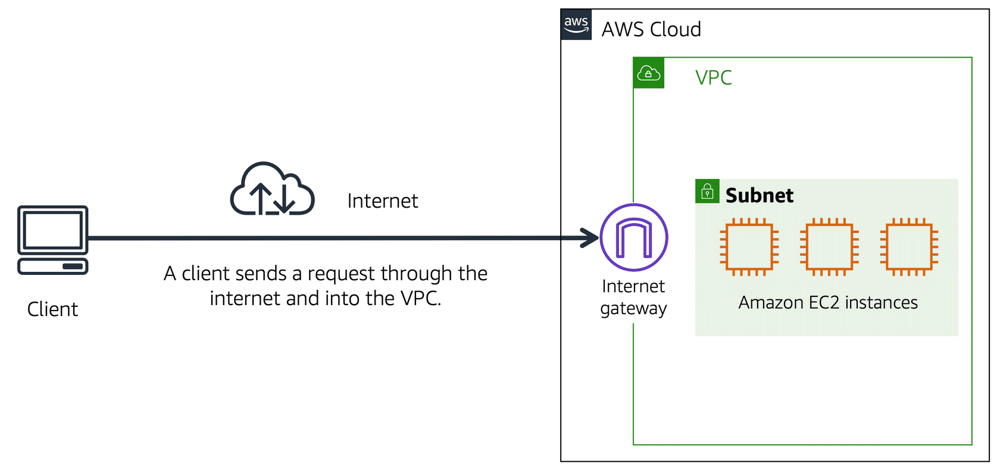
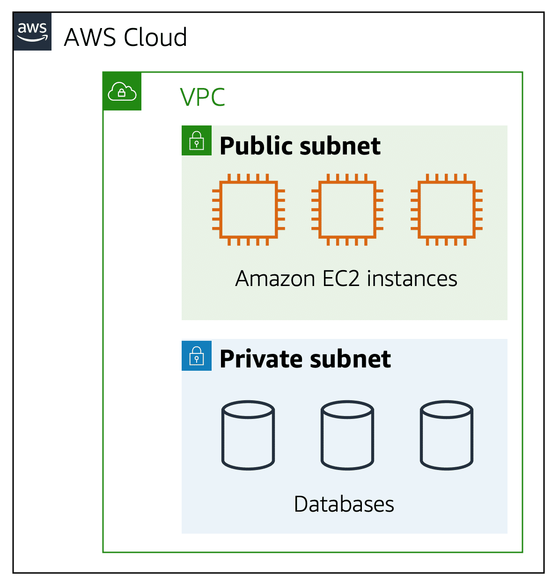
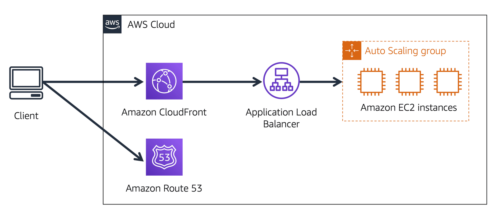

# Networking
## Connectivity to AWS
### Amazon Virtual Private Cloud (Amazon VPC)
- establish boundaries around AWS Resource
- launch resources in self defined virtual network
- Organize resources into subnet

### Internet gateway
- grant public acccess from internet to VPC
- connection between VPC and internet

### Virtual Private Gateway

-  virtual private network (VPN) connection that encrypts (or protects) your internet traffic from all the other requests around it. 
- Allowed protected internet traffic to enter into the VPC.

### AWS Direct Connect
- establish a dedicated private connection between your data center and a VPC.

### Network Access Control List

#### Subnet
- a group of resource based on security or operation needs
- public: frontend website
- private: database
  

#### Traffic in VPC
- A packet required to check for permision before reaching the subnet
- Determined by the sender and destination subnet

### Network ACLs
- virtual firewall that controls inbound and outbound traffic at the subnet level
- by default it allowed all inbound and outbound traffic
- all network ACLs have an explicit deny rule and deny all packet that doesn't match the rule

### Security group
- virtual firewall that controls inbound and outbound traffic for an Amazon EC2 instance.
- by default it allowed all outbound and deny all inbound
- multiple instance and adhere the same security group

### Stateless packet filtering
- remember nothing and check packets that cross the subnet border each way: inbound and outbound
- always check the packet and match it with rule

### Stateful packet filtering
- remember the previous packet request and grant access irregardless of security group rules

## Global Network

### Domain Name System (DNS)
- DNS resolver of packet request the IP from DNS server for connection

### Amazon route 53
- route end users to internet applications hosted in AWS
- able to manage the DNS records for domain names
  - register new domain names directly in Route 53
  - transfer DNS records for existing domain names managed by other domain registrars. 
  