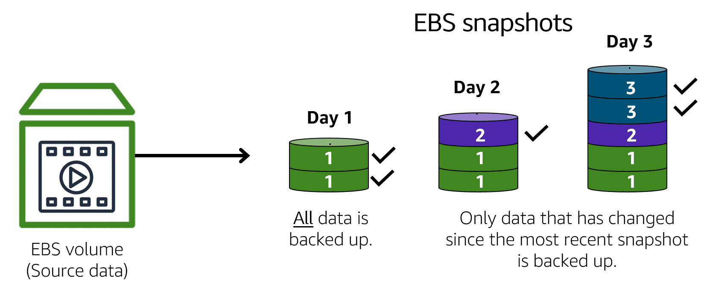

# Storage and Database
#### Instance stores
- Block level physical storage
- all data lost when instance terminated
## Amazon Elastic Block Store (Amazon EBS)
- block-level storage volumes attached to host computer of EC2 Instance
- Data remain after termination of instances, best for retain data
- Creation required configuration of size and type, then attached it to EC2 Instance
### EBS Snapshot
- backup system for EBS
- Increment backup. Only data that have changed since most recent snapshot are saved
- 

## Amazon Simple Storage Service (Amazon S3)
- object storage
  - consists of **data**, **metadata**, and a **key**.
- S3 is service that provides object-level storage
### lifecycle policies
- Policies created to move data between tier of storage class

## Amazon S3 storage classes
### Standard
- Stores data in a minimum of three Availability Zones, given it 11 nines of durability
- Designed for frequently accessed data

#### Standard Infrequent Access (IA)
- Ideal for infrequently accessed data
- Low storage price but high retrieval price

#### One Zne Infrequent Access (OneZone-IA)
- Store in one zone rather than three
- lower storage price
- only choosen if the data can be easily reproduced

#### Intelligent Tiering
- Unknown or changing access pattern
- required additional fees for monitoring and automation per object
- Change into IA, if hasn't access object for 30 days
- Change into Standard if access frequently

### Glacial
- Glacier are used for data archieved in a vault
- Can employ policy such as Write once read many and Lock the policy for future edit
#### Glacial Instant retrieval
- Works well for archived data that requires immediate access
- retrieve objects within a few milliseconds

#### Glacial Flexible retrieval
- lower cost for storage archive
- retrieve within a few mins to hour

#### Glacial Deep Archive
- Lowest cost
- retrieve within 12 hours

### Outpost
- Amazon S3 Outposts delivers object storage to your on-premises AWS Outposts
- Makes it easier to retrieve, store, and access data on AWS Outposts

## EBS vs S3
- Object vs Block
  - Object doesn't allowed minor modification, full reupload is needed
  - Block allowed minor modification
- S3 is useful for data that doesn't modify often and required frequent reading
- EBS is useful for constant modification and writing

## Amazon Elastic File System (Amazon EFS)
- store in multiple availablity zone
- uses File Storage structure
- Use when required multiple access of data at once
- EFS allows you to have multiple instances accessing the data with auto scaling
- Can be used in conjuction with EBS where EBS store with block storage and EFS access via filepath for client
- Compared to block storage and object storage, file storage is ideal for use cases in which a large number of services and resources need to access the same data at the same time.

## Relational Database
- Relational databases use structured query language (SQL) to store and query data.
### Amazon Relational Database Service(RDS)
- service that enables you to run relational databases in the AWS Cloud.
- Amazon RDS is available on six database engines
  - Amazon Aurora
  - PostgreSQL
  - MySQL
  - MariaDB
  - Oracle Database
  - Microsoft SQL Server

### Amazon Aurora
- Amazon Aurora(opens in a new tab) is an enterprise-class relational database
- It is up to five times faster than standard MySQL databases and up to three times faster than standard PostgreSQL databases.
- replicates six copies of your data across three Availability Zones and continuously backs up your data to Amazon S3.

## Nonrelational databases
- non SQL no relational database
- usually key and value based, can allowed variation of data in the table
- simple flexible schema

### Amazon DynamoDB
- key-value database service
- fast response time and highly scalable
- serverless and doesn't required provision, patch and management on the server

## Amazon Redshift
- data warehousing service that you can use for big data analytics
- massively scalable.
- collect data from many sources and understand relationships and trends across your data.

## AWS Database Migration Service
- Migrate from Source to destination
- Source is fully operational during migration
- can be migrated between two different structure like mysql to postgresQL
- can be used for 
	- development and test on production data
	- Consolidate all the database into one centre database
	- Continuous replication for backing up data

## Additional Database
### Amazon DocumentDB
- document database service that supports MongoDB workloads.
- content management, catalogs, user profiles

### Amazon Neptune
- graph based database
- engineered for social networking, recommendation engines and fraud detection 

### Amazon Managed Blockchain
-  create and manage blockchain networks with open-source frameworks. 
- useful for deploying decentralized immutable database

### Amazon Quantum Ledger Database (Amazon QLDB)
- ledger database service. 
- 100% immutable
- review a complete history of all the changes that have been made to your application data

### Amazon ElastiCache
- Caching layer on top of database to improve read times
- support two type of data stores, redis and memcached

### Amazon DynamoDB Accelerator (DAX)
- in-memory cache for DynamoDB. 
- improve response times from single-digit milliseconds to microseconds.
 