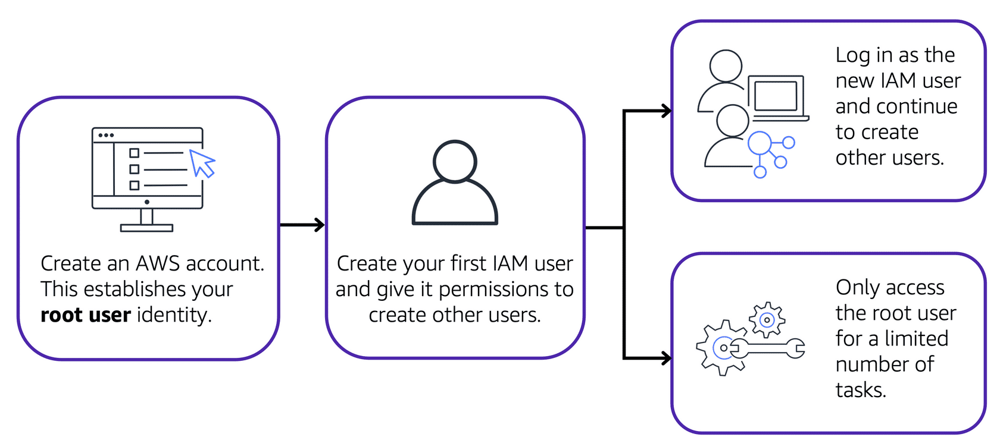
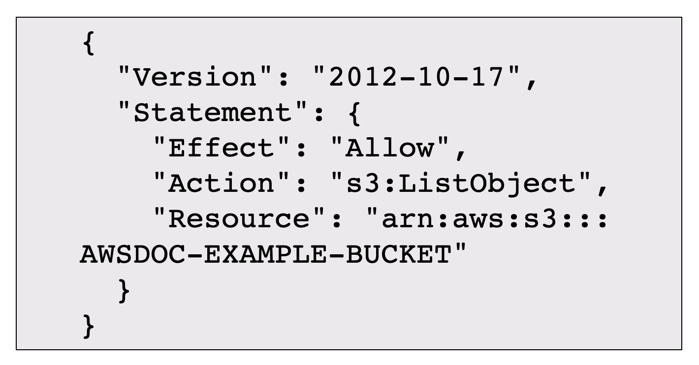
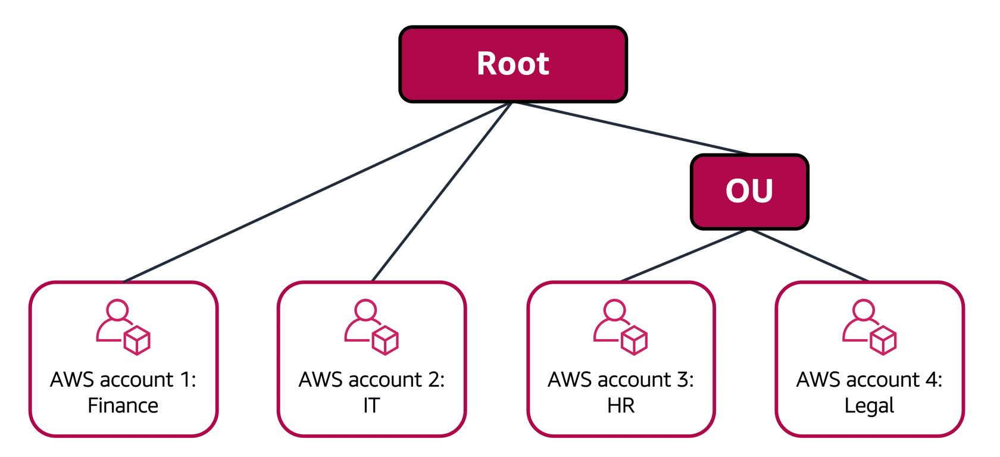
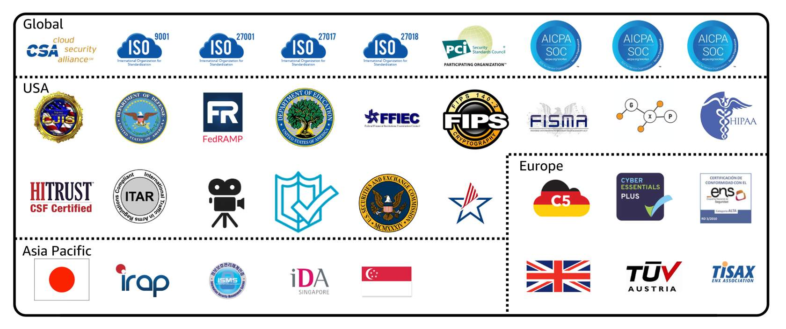
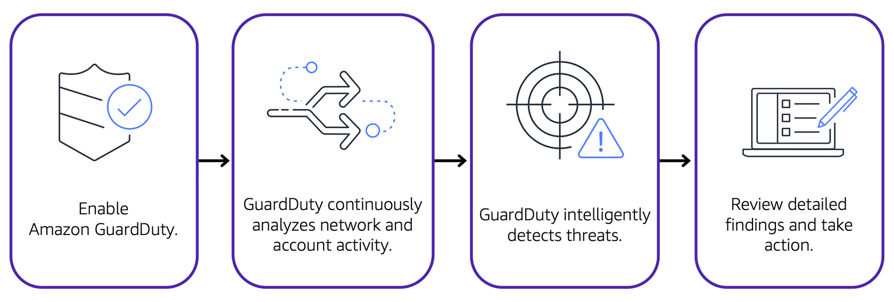

# Security
## Shared Responsibility Model

### Customers responsibility 
- responsible for the security of everything that they create and put in the AWS Cloud.
### AWS responsibility
- responsible for security of the cloud.

## AWS Identity and Access Management (IAM)
### AWS account root user
- first user created for a AWS account is root user
- recommneded to turn on Multi factor Authetication
- not recommended to use root user for day to day usage
- create your first IAM user and assign it permissions to create other users.

### Multi-factor authentication
-  multi-factor authentication (MFA) provides an extra layer of security for your AWS account by going thru multiple authentication

### IAM users
- IAM have no permission associated with it by default
- Permission have to be granted to the IAM user for access
- create IAM user for each individual users which provide additional security by allowing each IAM user to have a unique set of security credentials.

### IAM policies
- document that allows or denies permissions to AWS services and resources.  
- best practice would be granting least privilage permisssion

### IAM groups
- IAM group is a collection of IAM users
- when assign IAM policy to a group, all users in the group are granted permissions specified by the policy.

### IAM roles
- IAM role is an identity that you can assume to gain temporary access to permissions instead of long term.
- use when user required to take up different role/task/permission
- user have to be given the permission to switch role before switching
- user have to give up all their previous role privilage when switching to new  role

## AWS Organizations
- consolidate and manage multiple AWS accounts within a central location
- automatically creates a root, which is the parent container 
- consolidate billing for discount
- hierarchical groupings ofaccounts to meet security, compliance, or budgetary needs

###  service control policies (SCPs)
- SCPs enable you to place restrictions on the AWS services, resources, and individual API actions that users and roles in each account can access.
- can be applied to rganization root, an individual member account, or an OU

### Organizational units
- group accounts into organizational units 
- OU automatically inherit policy applied to it
- for example HR and Legal required similar access

## Compliance
- Required to meet the compliance of AWS and the regional governemnt
- AWS also offers multiple whitepapers and documents that be downloaded and use for compliance reports
### AWS Artifact
- provides on-demand access to AWS security and compliance reports and select online agreements
- provide report such as AWS ISO certifications, Payment Card Industry (PCI) reports, and Service Organization Control (SOC) reports.
#### AWS Artifact Agreements
- review, accept, and manage agreements for an individual account and for all your accounts in AWS Organizations
#### AWS Artifact Reports
- provide compliance reports from third-party auditors. These auditors have tested and verified that AWS is compliant with a variety of global, regional, and industry-specific security standards and regulations

### Customer Compliance Center
- contains resources to help you learn more about AWS compliance. 
- access compliance whitepapers and documentation 
  - AWS answers to key compliance questions
  - An overview of AWS risk and compliance
  - An auditing security checklist
- provide audit learning path

## Attacks
### Denial-of-service attacks
- denial-of-service (DoS) attack is a deliberate attempt to make a website or application unavailable to users.
- with excessive network traffic until the targeted website or application becomes overloaded and is no longer able to respond.

### Distributed denial-of-service attacks
- multiple sources are used to start an attack that aims to make a website or application unavailable.

## AWS Shield
- protects applications against DDoS attacks.
### AWS Shield Standard
- automatically protects all AWS customers at no cost. It protects your AWS resources from the most common, frequently occurring types of DDoS attacks. 
- detect malicious traffic in real time and automatically mitigates it. 
### AWS Shield Advanced
- paid service that provides detailed attack diagnostics and the ability to detect and mitigate sophisticated DDoS attacks. 
- integrates with other services such as Amazon CloudFront, Amazon Route 53, and Elastic Load Balancing to mitigate complex DOS

## AWS Key Management Service (AWS KMS)
- perform encryption operations through the use of cryptographic keys
- create, manage, and use cryptographic keys. You can also control the use of keys across a wide range of services and in your applications.

## AWS WAF
- web application firewall that lets you monitor network requests that come into your web applications with web access control list (ACL)
- works together with Amazon CloudFront and an Application Load Balancer.

## Amazon Inspector
- running automated security assessments
- inspect for security vulnerabilities and deviations from security best practices
- AWS does not guarantee that following the provided recommendations resolves every potential security issue

## Amazon GuardDuty
- intelligent threat detection for your AWS infrastructure and resources
- identifies threats by continuously monitoring the network activity and account behavior within your AWS environment.
- display detailed finding on AWS management console
- Possible to utilizing AWS lambda function to automate response to security finding
