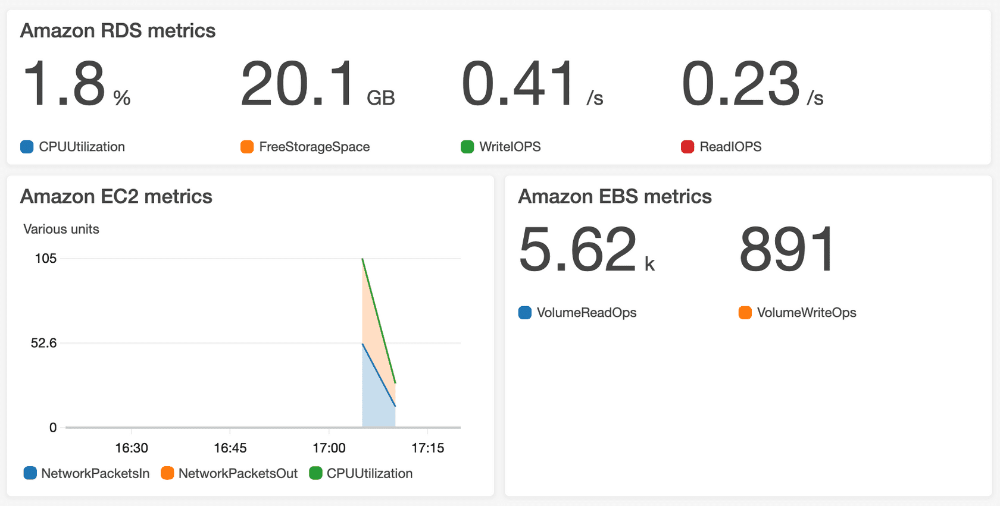
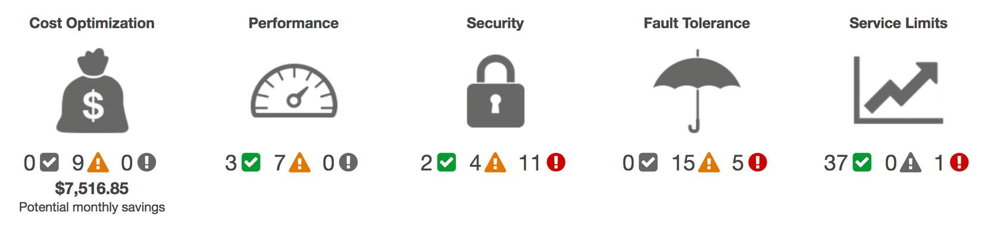

# Monitoring
## Amazon CloudWatch
- monitor and manage various metrics and configure alarm actions based on data from those metrics.
- tracking metric of resource and create graphs automatically 

### CloudWatch alarms
- automatically perform actions if the value of your metric has gone above or below a predefined threshold. 

## AWS CloudTrail
- API auditing tool 
- API caller, the time of the API call, the source IP address of the API caller
- view a complete history of user activity and API calls for your applications and resources. 
- Filter logs to assist with operational analysis and troubleshooting

### CloudTrail Insights
- optional feature allows CloudTrail to automatically detect unusual API activities 

## AWS Trusted Advisor
- Automated advisor compare resources with **5** 5 pillar of best practices
  - cost optimization
      - turn off unused instances
  - performance
      - capacity reached for EBS
  - security
	  - weak password policies for IAM users
  - fault tolerance
      - no backup for database
  - service limits.
      - approaching soft limits of service

- offers a list of recommended actions and additional resources to learn more about AWS best practices. 

