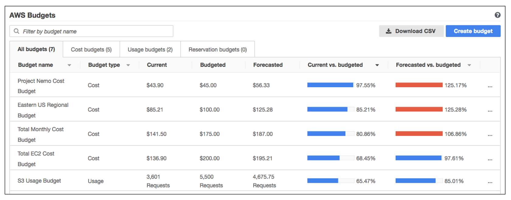
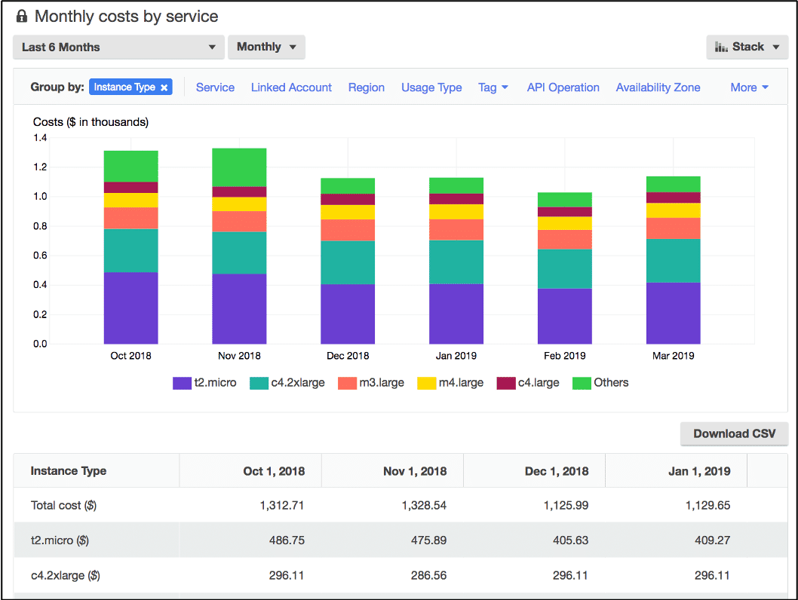
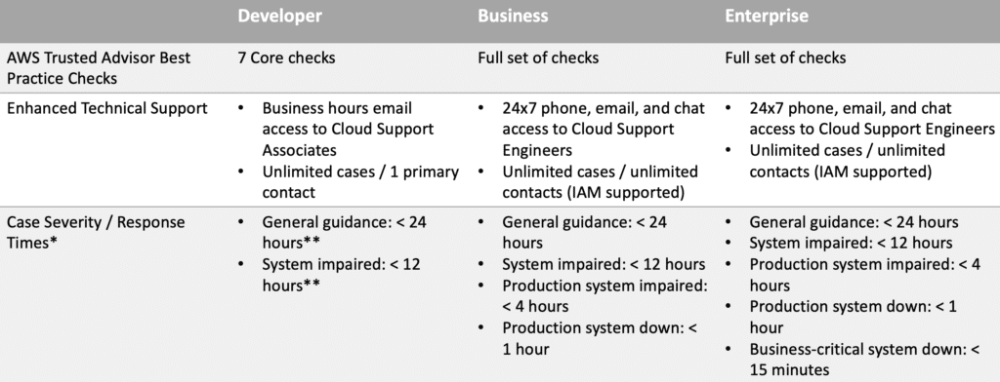
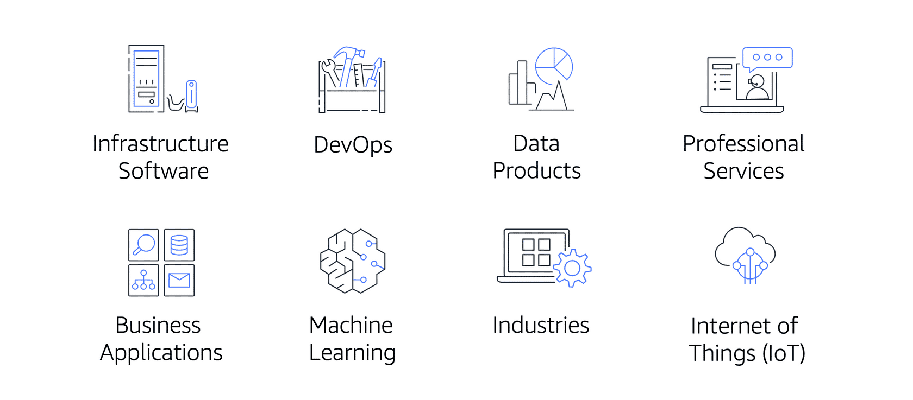

# Pricing
## AWS Free Tier
### Always Free
- These offers do not expire and are available to all AWS customers.
- AWS Lambda allows 1 million free requests 
- Amazon DynamoDB allows 25 GB of free storage per month.

### 12 Months Free
- 12 months following your initial sign-up date to AWS.

### Trials
- Short-term free trial offers start from the date you activate a particular service
- Amazon Inspector offers a 90-day free trial

## AWS Pricing Concepts
### Pay for what you use
- only pay for the usage
### Pay less when reserved
- reservation options that provide a significant discount
### Pay less with volume based discount
- per-unit-cost lower with increased usage

## AWS Pricing Calculator
- explore AWS services and create an estimate for the cost of your use cases on AWS

## AWS pricing examples
### AWS Lambda
- charged based on the number of requests for your functions and the time that it takes for them to run.
- allows 1 million free requests and up to 3.2 million seconds of compute time per month.
- Compute Savings Plan, committing to a consistent 1 or 3 year term

### Amazon EC2
- pay for only the compute time that you use while your instances are running
- Spot Instance would provide you with up to 90% cost savings if the server interuption is acceptable

### Amazon S3
- following cost components:
  - Storage
    - base on storage size, storage class and duration
  - Requests and data retrievals
    - pay for requests made to your Amazon S3 objects and buckets
  - Data transfer
    - no cost to transfer to other service in the same region
	- pay for data that you transfer into and out of Amazon S3 except for
	  - data transferred into Amazon S3 from the internet or out to Amazon CloudFront
	  - data transferred out to an Amazon EC2 instance in the same AWS Region as the Amazon S3 bucket
  - Management and replication
    - pay for the storage management features such as Amazon S3 inventory, analytics, and object tagging/

## Consolidated billing
- AWS organization feature
- Consolidate account billing to share large bulk of discount
- Consolidated billing also enables you to share volume pricing discounts across accounts. 

## AWS Budget
-  create budgets to plan your service usage, service costs, and instance reservations.
- set custom alerts when your usage exceeds (or is forecasted to exceed) the budgeted amount.
- The information in AWS Budgets updates three times a day.

## AWS Cost Explorer
- visualize, understand, and manage your AWS costs and usage over time.
- includes a default report of the costs and usage for your top five cost-accruing AWS services.

## AWS Support Plan
- ### Basic feature
  - 24/7 customer service
  - Documentation
  - Support Forum
  - AWS Trust advisor
  - ### AWS Personal Health dashboard
     -  tool that provides alerts and remediation guidance when AWS is experiencing events 

- ### Developer Feature extend Basic
  - client side diagnostic tool
  - best practice guidance
  - building block architecture

- ### Business Support extends Develop
  - production
  - Lowest cost to unlock all advisor check
  - limited support for 3rd party software

- ### Enterprise on ramp extend Business
  - A **pool of Technical Account Managers** to provide proactive guidance and coordinate access to programs and AWS experts
  - Technical Account Managers (TAM)
  -  Cost Optimization workshop (one per year)
  -  Concierge support team for billing and account assistance
  - Tools to monitor costs and performance through Trusted Advisor and Health API/Dashboard
  - 30 minutes or less response time for business-critical issues
  - Support automation workflows

- ### Enterprise extend Enterprise on ramp
  - Provide a designated Technical Account Manager
  - 

## Technical Account Manager (TAM)

The **Enterprise On-Ramp** and **Enterprise Support** have Technical Account Manager (TAM).
- TAM is your primary point of contact at AWS

## Marketplace
- a digital catalog that includes thousands of software listings from independent software vendors to find, test, and buy software that runs on AWS. 

