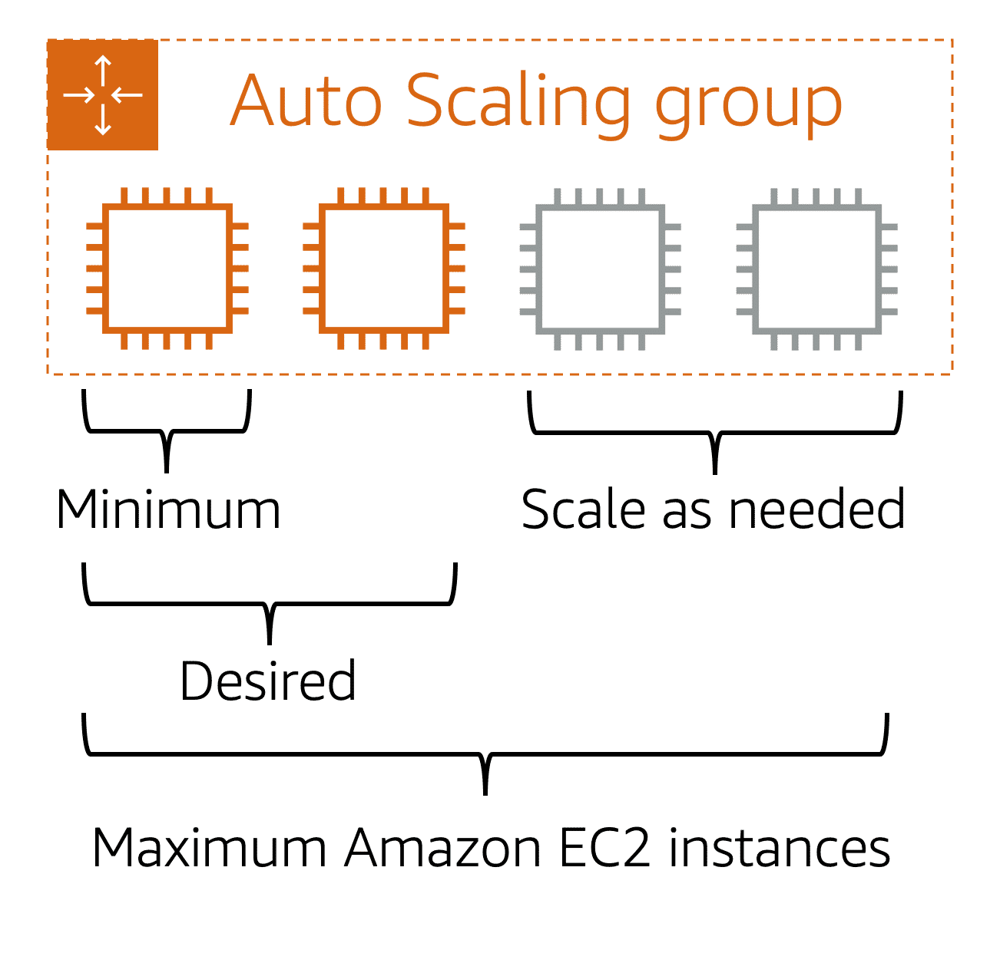
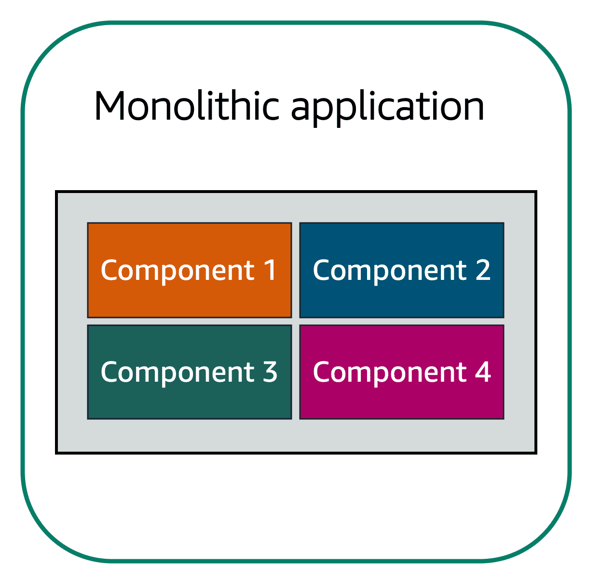
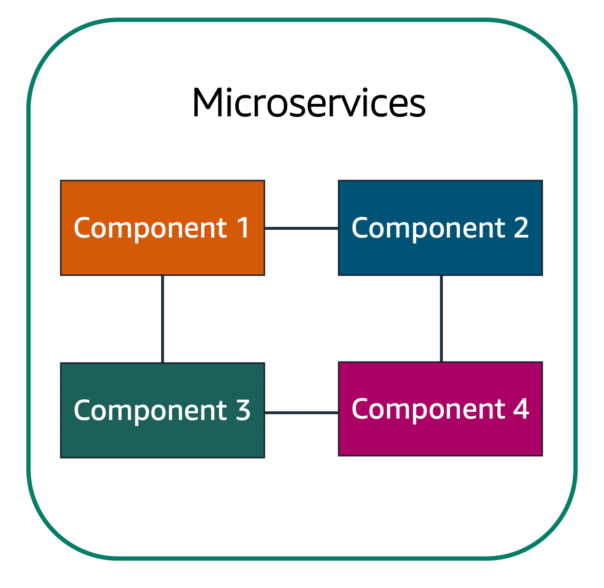

# Compute in cloud

## Amazon Elastic Compute Cloud (Amazon EC2)

- Flexibility in deployment and termination
- Fair pricing module, only pay what you use, both time and capacity

## EC2 Instance Type

### General Purpose

- balanced of all thing
- Equivalent needs of compute, memory, networking
- small, medium database, application server, gaming server

### Compute optimized

- high performance processor for computing power
- high performance web server, gaming server.

### Memory optimized

- Memory intensitve workload that process large dataset in memory
- preloading large dataset into memory for direct access of CPU
- processing a large unstructured data in real time

### Accelerated Computing

- Hardware acceleration and coprocessor. Usually GPU related computing
- gaming application, streaming and application streaming that required GPU intensive task

### Storage Optimized

- High sequential write and read access to large dataset
- suitable for data warehouse, online transaction processing system

## EC2 Pricing on instances

### on-demand

- no upfront cost, only pay for compute time usage
- Most expensive.
- Good for irregular workload that can't be interrupted

### Reserved

- Apply on-demand for fixed period for **1** or **3** year, with 3 years being the greater cost saver

- #### Standard Reserved

  - limited flexiblity, unable to change the instance type
  - suitable for stable workload with predictable usage
  - cheaper than convertible
  - Need to specify **Instance type and size**, **Platform description** and **Tenancy** (default or dedicated) qualification before initialization

- #### Convertible Reserved

  - flexible, allow modification of instance type, platform/OS, tenancy
  - suitable for dynamic workload where flexiblity is crucial

### EC2 Instance Savings Plans

- an hourly spend commitment to an instance family and Region for a 1-year or 3-year
- Do not need to specify **Instance type and size**, **Platform description** and **Tenancy** to get the discount on it
- good option if you need flexibility in your Amazon EC2 usage over the duration of the commitment term

### Spot Instances

- offer unused EC2 capacity and saving up to 90% compare to on-demand
- Suitable for workload that can be interrupted

### Dedicated Host

- Physical server fully dedicated for use
- Most expensive out of all pricing option

## Scaling

### Auto Scaling

- Scaling the instance based on workload
- required to set Minimun, Desired and Maximum capacity

### Elastic load balancing

- A load balancer acts as a single point of contact for all incoming web traffic to your Auto Scaling group.
- requests spread across multiple resources that will handle them
- It can handled backend as by ELB directs traffic to the back end that has the least outstanding requests. Now, if the back end scales, once the new instance is ready,
- eg, 2 request on 2 instance = 1 request to each instances

## Monolithic and microservice

- Monolithic
  - tightly coupled components(server, database)
  - single component fail, the rest fai

- microservices
  - loosely coupled component
  - required Amazon SNS and Amazon SQS to facilitate application integration

## Messaging and Queueing

### Amazon Simple Queue Service

- allows you to send, store, and receive messages between software components at any volume

### Amazon Simple Notification Service

- used to send out messages to services, but it can also send out notifications to end users. It does this in a different way called a publish/subscribe or pub/sub model

## Serverless Computing

### Amazon Lambda

- run code without needing to provision or manage servers.
- pay only for the compute time that you consume. Charges apply only when your code is running. You can also run code for virtually any type of application or backend service, all with zero administration

### Amazon Elastic Container Service (Amazon ECS)

- high-performance container management system that enables you to run and scale containerized applications on AWS.
- Amazon ECS supports Docker containers. Docker(opens in a new tab) is a software platform that enables you to build, test, and deploy applications quickly.

### Amazon Elastic Kubernetes Service (Amazon EKS)

- managed service that you can use to run Kubernetes on AWS
- Kubernetes(opens in a new tab) is open-source software that enables you to deploy and manage containerized applications at scale.

### AWS Fargate

- serverless compute engine for containers
- It works with both Amazon ECS and Amazon EKS
- When using AWS Fargate, you do not need to provision or manage servers. AWS Fargate manages your server infrastructure for you